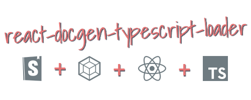

<p align="center">
  
</p>

<p align="center">
Webpack loader to generate docgen information from TypeScript React components. The primary use case is to get the prop types table populated in the <a href="https://github.com/storybooks/storybook/tree/master/addons/info">Storybook Info Addon.
</a>
</p>

<p align="center">
  <a href="https://www.paypal.com/cgi-bin/webscr?cmd=_s-xclick&hosted_button_id=NNRJYNNY5YTJ2">
    
  </a>
</p>


<p align="center">
  
  <br>
  <a href="./packages/react-docgen-typescript-loader-example">Example Storybook project</a>
</p>

## Installation

### Requirements

Requires TypeScript 2.3 or above.

### Add the package as a development dependency.

```shell
$ npm install --save-dev react-docgen-typescript-loader

or

$ yarn add --dev react-docgen-typescript-loader
```

### Performance

There is a significant startup cost due to the initial type parsing. Once the project is running in watch mode, things should be smoother due to Webpack caching.

#### Optional Performance Setting

You can speed up the loading performance by restricting the set of project files which are processed by the parser. It accepts an optional array of includes and excludes as strings (converted to regular expressions). By default `includes` is set to `["\\.tsx$"]` and excludes is set to `["node_modules"]`.

Folder structure:

```
/src/components/
  /SimpleButton/SimpleButton.tsx
  /SimpleButton/SimpleButton.stories.tsx
```

Webpack:

```javascript
{
  test: /\.tsx?$/,
  exclude: /node_modules/,
  use: [
    "ts-loader",
    {
      loader: "react-docgen-typescript-loader",
      options: {
        includes: ["components.*\\.tsx$"],
        excludes: ["stories\\.tsx$"]
      }
    }
  ]
}
```

### Alternative Implementation

This plugin uses a Webpack loader to inject the docgen information. There is also a version which works as a Webpack plugin. I will be supporting both versions. The loader version more accurately generates the injected code blocks and should work with all module types but at the cost of a longer initial startup. The plugin version may be faster.

The Webpack plugin version is available here:
https://github.com/strothj/react-docgen-typescript-loader/tree/plugin

### Add the loader to your Webpack configuration.

**IMPORTANT:** Webpack loaders are executed right-to-left (or bottom-to-top). `react-docgen-typescript-loader` needs to be added under `ts-loader`.

Example Storybook config `./storybook/webpack.config.js`.

```javascript
const path = require("path");
const genDefaultConfig = require("@storybook/react/dist/server/config/defaults/webpack.config.js");

module.exports = (baseConfig, env) => {
  const config = genDefaultConfig(baseConfig);

  config.module.rules.push({
    test: /\.tsx?$/,
    include: path.resolve(__dirname, "../src"),
    use: [
      require.resolve("ts-loader"),
      require.resolve("react-docgen-typescript-loader"),
    ],
  });

  config.resolve.extensions.push(".ts", ".tsx");

  return config;
};
```

## Optional Loader Options

| Option               | Type                       | Description                                                                                                                                                                                                                                                                    |
| -------------------- | -------------------------- | ------------------------------------------------------------------------------------------------------------------------------------------------------------------------------------------------------------------------------------------------------------------------------ |
| skipPropsWithName    | string[] or string         | Avoid including docgen information for the prop or props specified.                                                                                                                                                                                                            |
| skipPropsWithoutDoc  | boolean                    | Avoid including docgen information for props without documentation.                                                                                                                                                                                                            |
| tsconfigPath         | string                     | Specify the location of the tsconfig.json to use. Can not be used with compilerOptions.                                                                                                                                                                                        |
| compilerOptions      | typescript.CompilerOptions | Specify TypeScript compiler options. Can not be used with tsconfigPath.                                                                                                                                                                                                        |
| docgenCollectionName | string or null             | Specify the docgen collection name to use. All docgen information will be collected into this global object. Set to `null` to disable. Defaults to `STORYBOOK_REACT_CLASSES` for use with the Storybook Info Addon. https://github.com/gongreg/react-storybook-addon-docgen    |
| setDisplayName       | boolean                    | Automatically set the components' display name. If you want to set display names yourself or are using another plugin to do this, you should disable this option. Defaults to `true`. This is used to preserve component display names during a production build of Storybook. |
| includes             | string[]                   | Converted to an array of regular expressions. Files matching these regular expressions will be processed by the parser. Defaults to `["\\.tsx$"]`                                                                                                                              |
| excludes             | string[]                   | See includes. Any file matched by includes will be checked against excludes. Any matching excludes will not be processed by the parser. Defaults to `["node_modules"]`.                                                                                                        |

## Usage

### Storybook Info Addon

Include the `withInfo` decorator as normal.
Reference the addon documentation for the latest usage instructions:
https://github.com/storybooks/storybook/tree/master/addons/info

**Special Note:**

The Storybook Info Addon is able to populate the story description from your component's documentation. It does this when your story name matches the display name of your component. The prop tables will popular in either case.

If you have a component named
`ColorButton`, then you would have to use something like: `storiesOf("...", module).add("ColorButton", ...)` to have the story description come from the component description.

In addition to the description from the component, you may still include story description text using the normal withInfo api.

**It is important** to export your component using a named export for docgen information to be generated properly.

---

`ColorButton.tsx`:

```javascript
import * as React from "react";

interface ColorButtonProps {
  /**
   * Buttons background color
   **/
  color: "blue" | "green";

  /**
   * Font size in rem.
   *
   * @default 2
   */
  fontSize?: number;
}

/**
 * A button with a configurable background color.
 *
 * Notice the named export here, this is required for docgen info to be
 * generated correctly.
 **/
export const ColorButton: React.SFC<ColorButtonProps> = props => (
  <button
    style={{
      padding: 40,
      color: "#eee",
      backgroundColor: props.color,
      fontSize: `${props.fontSize || 2}rem`,
    }}
  >
    {props.children}
  </button>
);

// Can still be exported as default if it has a named export.
export default ColorButton;
```

`ColorButton.stories.tsx`:

```javascript
import * as React from "react";
import { storiesOf } from "@storybook/react";
import { withInfo } from "@storybook/addon-info";
import ColorButton from "./ColorButton";

storiesOf("Components", module).add(
  "ColorButton",
  withInfo({ inline: true })(() => (
    <ColorButton color="blue">Color Button</ColorButton>
  )),
);
```

## Experimental

This loader is a work in progress. If you encounter an issue, please feel free to open an issue.

## Limitations

This plugin makes use of the project:
https://github.com/styleguidist/react-docgen-typescript

It is subject to the same limitations. Component docgen information can not be
generated for components that are only exported as default. You can work around
the issue by exporting the component using a named export.

```javascript
import * as React from "react";

interface ColorButtonProps {
  /** Buttons background color */
  color: "blue" | "green";
}

/** A button with a configurable background color. */
export const ColorButton: React.SFC<ColorButtonProps> = props => (
  <button
    style={{
      padding: 40,
      color: "#eee",
      backgroundColor: props.color,
      fontSize: "2rem",
    }}
  >
    {props.children}
  </button>
);

export default ColorButton;
```

## Contributing

Pull requests are welcome. For major changes, please open an issue first to discuss what you would like to change.

Please make sure to update tests as appropriate.

## Credits

### SVG Logos
* https://prettier.io
* https://seeklogo.com

## License

[MIT](https://choosealicense.com/licenses/mit/)
